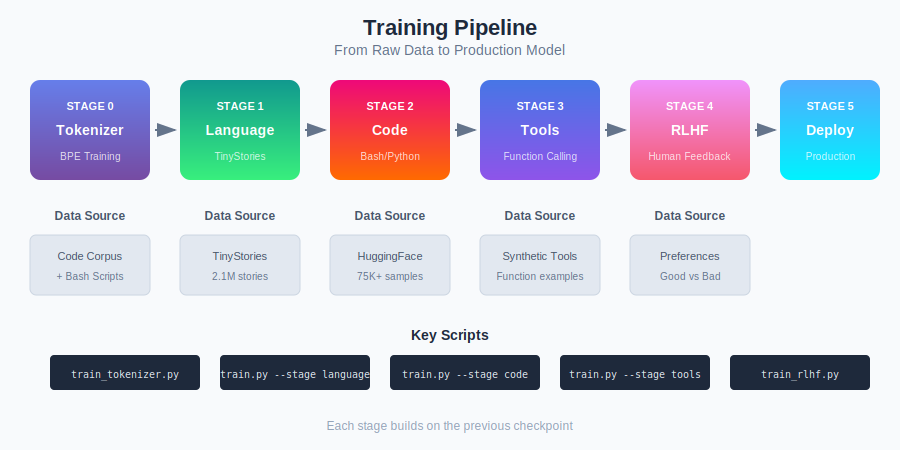
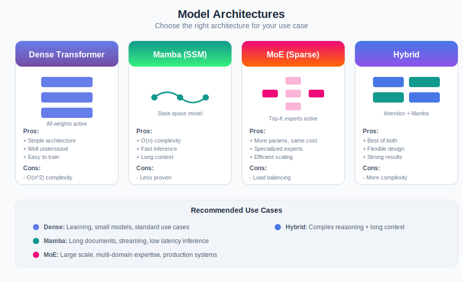

# Advanced Code Model

[](https://pytorch.org/)
[](https://www.python.org/downloads/)
[](https://www.apple.com/mac/)

**Train your own code generation model from scratch on Apple Silicon.**

Build a production-ready coding agent with multi-architecture support (Dense, Mamba, MoE, Hybrid) - all running locally with $0 cloud costs.



---

## Start Here

| Goal | Guide | Time |
|------|-------|------|
| **Run the model** | [Quick Start](docs/01-QUICKSTART.md) | 5 min |
| **Understand LLMs** | [Core Concepts](docs/02-CONCEPTS.md) | 30 min |
| **Compare architectures** | [Architecture Guide](docs/03-ARCHITECTURE.md) | 20 min |
| **Train from scratch** | [Training Pipeline](docs/04-TRAINING-PIPELINE.md) | Full guide |
| **Deploy to production** | [Deployment Guide](docs/05-DEPLOYMENT.md) | 45 min |

**New here?** Start with [docs/00-LEARNING-PATH.md](docs/00-LEARNING-PATH.md) to find your path.

---

## Quick Install

```bash
# Clone and setup
git clone <repo-url>
cd advanced-code-model
python3 -m venv venv && source venv/bin/activate
pip install -r requirements.txt

# Verify MPS is available (Apple Silicon)
python3 -c "import torch; print(f'MPS: {torch.backends.mps.is_available()}')"
```

## Quick Train

```bash
# Stage 0: Train tokenizer
python scripts/train_code_tokenizer.py

# Stage 1: Language pretraining
python scripts/train.py --stage language --model-size large \
    --use-rmsnorm --use-rope --use-compile --use-amp

# Stage 2: Code fine-tuning
python scripts/train.py --stage code \
    --checkpoint models/language_model_best.pth \
    --use-rmsnorm --use-rope --use-compile --use-amp
```

## Quick Test

```bash
python scripts/test_stage2.py
```

---

## Architectures



| Architecture | Best For | Complexity |
|--------------|----------|------------|
| **Dense Transformer** | Learning, standard tasks | O(n^2) |
| **Mamba (SSM)** | Long context, fast inference | O(n) |
| **MoE (Sparse)** | Multi-domain, scaling | O(n^2) |
| **Hybrid** | Complex reasoning + long context | Mixed |

See [Architecture Guide](docs/03-ARCHITECTURE.md) for detailed comparison.

---

## Training Pipeline

```
Stage 0: Tokenizer ──▶ Stage 1: Language ──▶ Stage 2: Code ──▶ Stage 3: Tools ──▶ Stage 4: RLHF ──▶ Deploy
```

| Stage | Purpose | Data | Output |
|-------|---------|------|--------|
| 0 | Learn vocabulary | Code + Text | `tokenizer.json` |
| 1 | Basic language | TinyStories | `language_model_best.pth` |
| 2 | Code generation | Bash, Python | `code_model_best.pth` |
| 3 | Function calling | Tool examples | `tool_model_best.pth` |
| 4 | Human alignment | Preferences | `rlhf_model_best.pth` |

See [Training Pipeline](docs/04-TRAINING-PIPELINE.md) for complete guide.

---

## Model Sizes

| Size | Parameters | VRAM | Best For |
|------|------------|------|----------|
| tiny | 10M | 1GB | Testing |
| medium | 150M | 4GB | Development |
| **large** | 1.6B | 12GB | **Production** (Recommended) |
| xlarge | 7B | 24GB | Best quality |

---

## Project Structure

```
advanced-code-model/
├── docs/                   # Documentation (START HERE)
│   ├── 00-LEARNING-PATH.md # Choose your path
│   ├── 01-QUICKSTART.md    # 5-minute setup
│   ├── 02-CONCEPTS.md      # Core LLM concepts
│   ├── 03-ARCHITECTURE.md  # Model architectures
│   ├── 04-TRAINING-PIPELINE.md  # Training guide
│   ├── 05-DEPLOYMENT.md    # Production deployment
│   ├── diagrams/           # SVG visualizations
│   └── reference/          # Detailed references
├── scripts/                # Training scripts
├── src/model/              # Model source code
├── data/                   # Training data
├── models/                 # Saved checkpoints
├── configs/                # YAML configurations
└── examples/               # Working examples
```

---

## Hardware Requirements

| Tier | Hardware | Capability |
|------|----------|------------|
| **Minimum** | M1/M2 16GB | Medium model, development |
| **Recommended** | M1/M2/M3 Max 48GB | Large model, production |
| **Maximum** | M1/M2 Ultra 128GB | XLarge model, best quality |

---

## Key Features

- **Multi-Architecture**: Dense, Mamba, MoE, Hybrid
- **10-Stage Pipeline**: Language → Code → Tools → RLHF → Production
- **Apple Silicon Optimized**: Native MPS acceleration
- **$0 Cloud Costs**: Train everything locally
- **Production Ready**: Quantization, API serving, Docker support

---

## Documentation

### Getting Started
- [Learning Path](docs/00-LEARNING-PATH.md) - Choose your path
- [Quick Start](docs/01-QUICKSTART.md) - 5-minute setup
- [Concepts](docs/02-CONCEPTS.md) - Understand LLMs

### In-Depth
- [Architectures](docs/03-ARCHITECTURE.md) - Compare Dense/Mamba/MoE/Hybrid
- [Training Pipeline](docs/04-TRAINING-PIPELINE.md) - Complete training guide
- [Deployment](docs/05-DEPLOYMENT.md) - Production deployment

### Reference
- [Script Reference](docs/reference/SCRIPT-REFERENCE.md) - All scripts explained
- [Config Reference](docs/reference/CONFIG-REFERENCE.md) - Configuration options
- [Troubleshooting](docs/reference/TROUBLESHOOTING.md) - Common issues

### Advanced Topics
- [RLHF Guide](docs/RLHF_GUIDE.md) - Human preference alignment
- [Tool Calling](docs/TOOL_CALLING_GUIDE.md) - Function calling
- [Multi-Modal](docs/MULTIMODAL_GUIDE.md) - Vision + Code
- [Production Readiness](docs/PRODUCTION_READINESS.md) - Enterprise deployment

---

## What You Can Build

After training, your model can:

- **Generate code** in any language (Bash, Python, SQL, etc.)
- **Execute tools** (run code, search docs, analyze, debug)
- **Understand context** (read codebases, follow instructions)
- **Follow preferences** (write clean, secure, efficient code)

All running **locally** with **complete privacy** and **$0 cost**.

---

## License

MIT License - See LICENSE for details.

---

**Ready to build your own code model?** Start with [docs/00-LEARNING-PATH.md](docs/00-LEARNING-PATH.md)!
