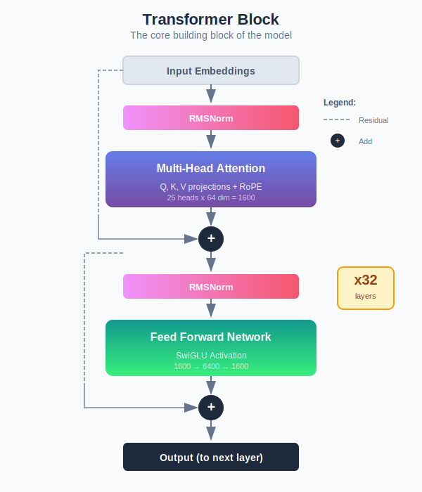

# Core Concepts

> Understand the fundamentals of how LLMs work.

---

## Table of Contents

1. [What is an LLM?](#what-is-an-llm)
2. [Tokenization](#tokenization)
3. [The Transformer Architecture](#the-transformer-architecture)
4. [Attention Mechanism](#attention-mechanism)
5. [Training Process](#training-process)
6. [Inference](#inference)

---

## What is an LLM?

A **Large Language Model (LLM)** is a neural network trained to predict the next token in a sequence. Given some text, it outputs a probability distribution over all possible next tokens.

```
Input:  "The cat sat on the"
Output: {"mat": 0.3, "floor": 0.2, "chair": 0.15, ...}
```

By sampling from this distribution and feeding the result back as input, we generate text one token at a time.

### Key Properties

| Property | Description |
|----------|-------------|
| **Autoregressive** | Generates tokens one at a time, left-to-right |
| **Probabilistic** | Outputs probability distributions, not fixed answers |
| **Context-dependent** | Output depends on all previous tokens |
| **Pretrained** | Learns general patterns from massive text corpus |

---

## Tokenization

Before text can be processed by a neural network, it must be converted to numbers. This is called **tokenization**.

### How Tokenization Works

```
Text:       "Hello, world!"
Tokens:     ["Hello", ",", " world", "!"]
Token IDs:  [15496, 11, 995, 0]
```

### BPE (Byte Pair Encoding)

We use **BPE tokenization**, which:

1. Starts with individual characters
2. Iteratively merges the most frequent pairs
3. Builds a vocabulary of subword units

```
Vocabulary examples:
- Common words: "the" → single token
- Rare words: "cryptocurrency" → ["crypto", "currency"]
- Code: "#!/bin/bash" → ["#!/", "bin", "/", "bash"]
```

### Why Subword Tokenization?

| Approach | Example | Problem |
|----------|---------|---------|
| Character-level | `h e l l o` | Too many tokens, slow |
| Word-level | `hello` | Can't handle unknown words |
| **Subword (BPE)** | `hel lo` | Best of both worlds |

### Code-Specific Tokenization

Our tokenizer is trained on code, so it handles:
- Shebangs: `#!/bin/bash` as meaningful units
- Operators: `==`, `!=`, `>=` as single tokens
- Indentation: Preserved as spaces/tabs

---

## The Transformer Architecture



The **Transformer** is the architecture behind modern LLMs. It consists of stacked layers, each containing:

1. **Multi-Head Attention** - Looks at relationships between all tokens
2. **Feed-Forward Network (FFN)** - Processes each position independently
3. **Residual Connections** - Add input to output (helps training)
4. **Layer Normalization** - Stabilizes training

### Our Model Specs (Large)

```python
d_model = 1600      # Hidden dimension
n_layers = 32       # Number of transformer blocks
n_heads = 25        # Attention heads
d_ff = 6400         # FFN intermediate dimension
max_seq_len = 4096  # Maximum sequence length
vocab_size = 32000  # Vocabulary size
```

**Total parameters: ~1.6 billion**

---

## Attention Mechanism

Attention is the key innovation that makes Transformers powerful. It allows every position to "attend to" (gather information from) every other position.

### Self-Attention Formula

```
Attention(Q, K, V) = softmax(QK^T / √d_k) V
```

Where:
- **Q (Query)**: "What am I looking for?"
- **K (Key)**: "What do I contain?"
- **V (Value)**: "What information do I provide?"

### Visual Example

```
Input: "The cat sat on the mat"

For the word "sat":
  - Attends strongly to "cat" (the subject)
  - Attends to "on" (the next word)
  - Attends weakly to "the" (less relevant)
```

### Multi-Head Attention

Instead of one attention operation, we run **multiple in parallel**:

```
Head 1: Focuses on syntax
Head 2: Focuses on semantics
Head 3: Focuses on position
...
Head 25: Focuses on something else
```

This allows the model to capture different types of relationships.

### RoPE (Rotary Position Embeddings)

We use **RoPE** to encode positional information:

- Encodes position as rotation angles
- Relative positions are naturally captured
- Generalizes better to longer sequences

---

## Training Process

### Objective: Next Token Prediction

```
Input:  "The cat sat on the"
Target: "mat"
Loss:   -log(P("mat"))  # Cross-entropy loss
```

The model learns to maximize the probability of the correct next token.

### Training Stages


| Stage | Goal | Data |
|-------|------|------|
| 1. Language | Learn grammar, facts | TinyStories (2M stories) |
| 2. Code | Learn programming | Bash, Python, SQL (75K samples) |
| 3. Tools | Learn function calling | Synthetic tool examples |
| 4. RLHF | Align with preferences | Human rankings |

### Optimization Details

```python
optimizer = AdamW(
    lr=1e-4,              # Learning rate
    weight_decay=0.1,     # Regularization
    betas=(0.9, 0.95),    # Momentum
)

# Learning rate schedule
warmup_steps = 2000       # Gradual increase
cosine_decay = True       # Gradual decrease
```

### Regularization Techniques

| Technique | Purpose |
|-----------|---------|
| Dropout | Prevent overfitting |
| Weight decay | Keep weights small |
| Gradient clipping | Prevent exploding gradients |
| Label smoothing | Soften targets |

---

## Inference

### Temperature Sampling

During generation, we can control randomness with **temperature**:

```python
logits = model(input_ids)
probs = softmax(logits / temperature)
next_token = sample(probs)
```

| Temperature | Effect |
|-------------|--------|
| 0.0 | Deterministic (always pick highest prob) |
| 0.7 | Balanced creativity |
| 1.0 | Standard sampling |
| 1.5+ | Very random, creative |

### Top-K and Top-P Sampling

**Top-K**: Only sample from the K most likely tokens

```python
top_k = 50  # Only consider top 50 tokens
```

**Top-P (Nucleus)**: Sample from tokens that comprise P% of probability mass

```python
top_p = 0.95  # Sample from tokens covering 95% probability
```

### KV-Cache

During generation, we cache the Key and Value computations:

```
Step 1: Compute K,V for tokens 1-100, cache them
Step 2: Only compute Q for token 101, reuse K,V cache
Step 3: Only compute Q for token 102, reuse K,V cache
...
```

This makes generation **O(n)** instead of **O(n²)**.

---

## Next Steps

- **Compare architectures**: [03-ARCHITECTURE.md](03-ARCHITECTURE.md)
- **Train your own model**: [04-TRAINING-PIPELINE.md](04-TRAINING-PIPELINE.md)
- **See the code**: `src/model/transformer.py`

---

## Further Reading

- [Attention Is All You Need](https://arxiv.org/abs/1706.03762) - Original Transformer paper
- [GPT-2 Paper](https://openai.com/research/better-language-models) - Scaling language models
- [RoPE Paper](https://arxiv.org/abs/2104.09864) - Rotary Position Embeddings
- [Flash Attention](https://arxiv.org/abs/2205.14135) - Efficient attention implementation
